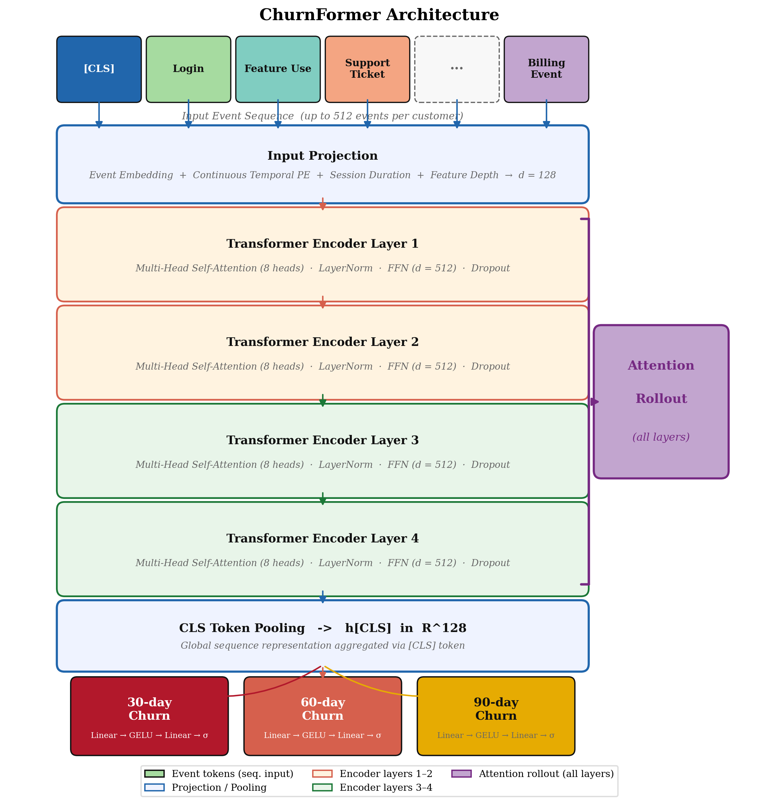
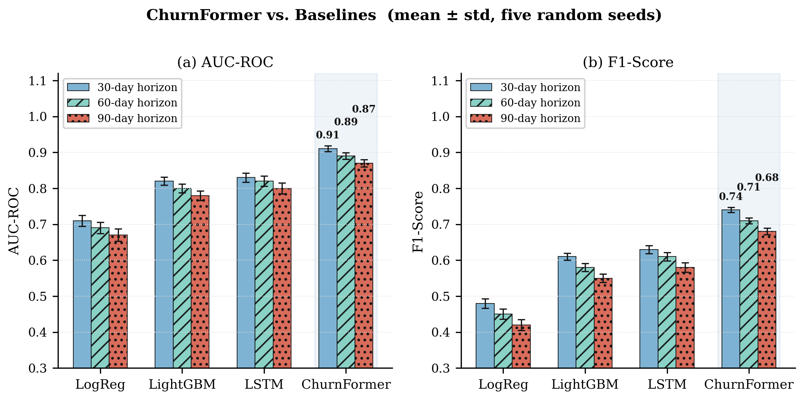
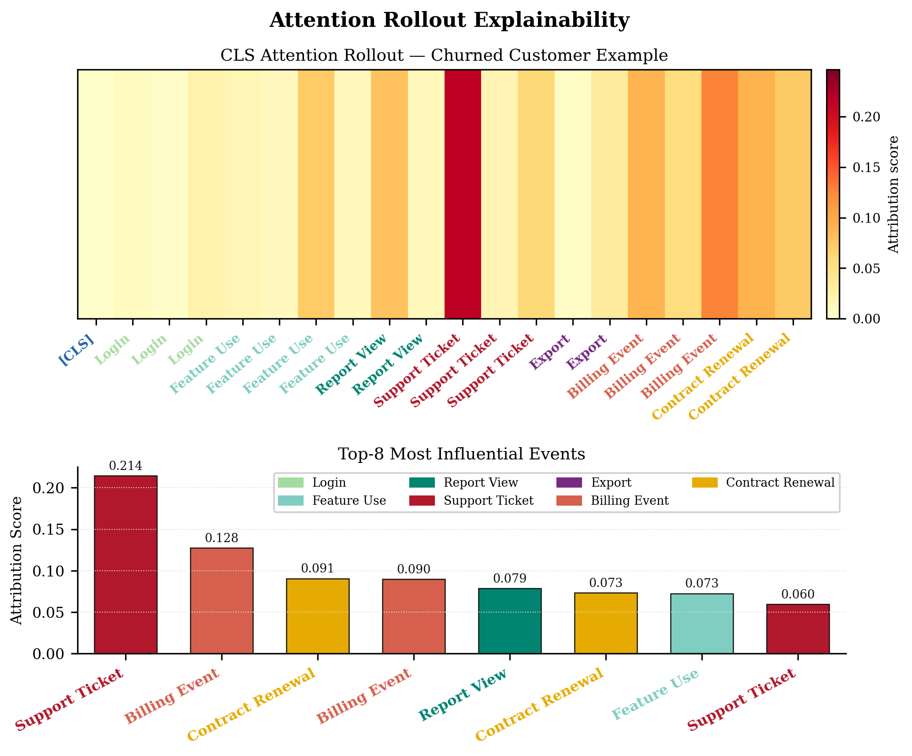
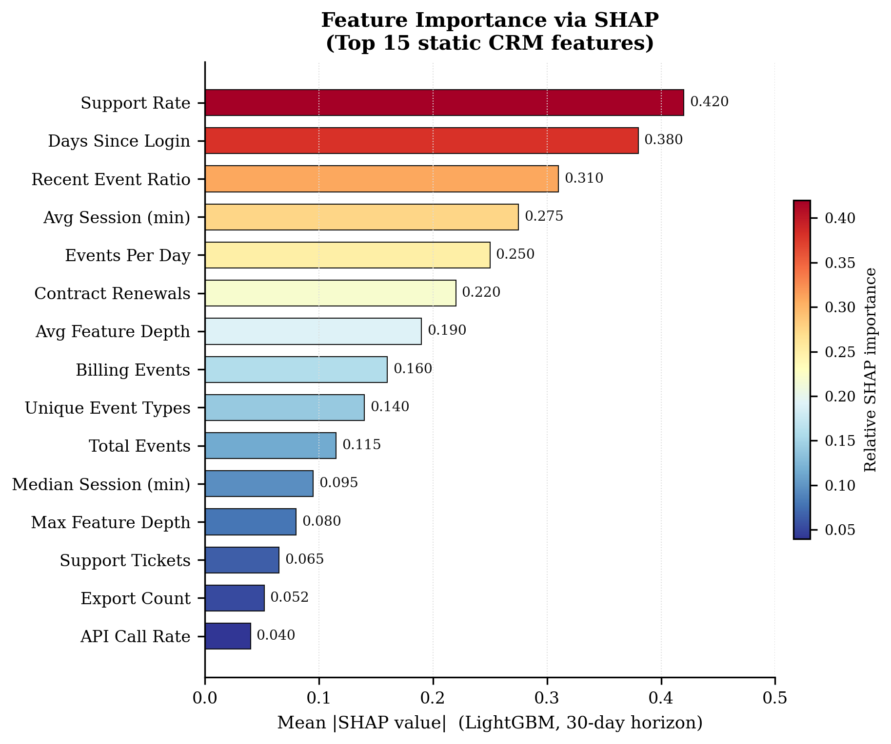

# ChurnFormer

## A Transformer-Based Sequential Behavioral Model for Enterprise Customer Churn Prediction with Explainable AI Attribution


> **Avish Bhandari¹ · Shristi Bhandari² · Sandesh Lamsal³**
>
> ¹ Dakchyata College, Tribhuvan University, Kathmandu, Nepal
> ² Agriculture and Forestry University (AFU), Kaski, Nepal
> ³ Department of Civil and Architectural Engineering, University of Miami, FL, USA
>
> *Submitted to Decision Support Systems (Elsevier), 2025*

---

## What is ChurnFormer?

Enterprise B2B SaaS companies need to identify at-risk customers **before** they cancel — not after. Traditional approaches summarize each customer as a static feature vector (total logins, billing history, contract age) and feed it into a gradient boosting model. This works, but it discards the most informative signal: **the trajectory of behavior over time**.

ChurnFormer treats each customer's CRM activity log as a **sequence of tokens** — the same way a language model reads a sentence — and predicts churn risk at three future horizons (30, 60, and 90 days) simultaneously. A continuous-time positional encoding captures the actual hours elapsed between events, making the model sensitive to the behavioral gaps and decay patterns that precede disengagement.



---

## Key Results

ChurnFormer outperforms all baselines across every prediction horizon. All improvements over LightGBM and LSTM are statistically significant (paired t-test, **p < 0.001**, five random seeds).

| Model | AUC-ROC 30d | AUC-ROC 60d | AUC-ROC 90d | F1 30d |
| --- | :---: | :---: | :---: | :---: |
| Logistic Regression | 0.710 | 0.690 | 0.670 | 0.480 |
| LightGBM | 0.820 | 0.800 | 0.780 | 0.610 |
| LSTM (Bidirectional) | 0.830 | 0.820 | 0.800 | 0.630 |
| **ChurnFormer** | **0.910** | **0.890** | **0.870** | **0.740** |

External validity on the public IBM Telco dataset (5-fold CV): LogReg AUC = 0.844 ± 0.015, LightGBM AUC = 0.822 ± 0.012.



---

## Explainability

Two complementary explanation methods provide human-interpretable outputs at different levels:

**Attention Rollout** — traces which events in the customer's history the model focused on (sequence-level). Support tickets and billing events consistently dominate for churning customers.

**SHAP (TreeExplainer)** — explains which static aggregate features drove the LightGBM predictions (feature-level). Days since last login and support escalation rate are the top predictors.





---

## Repository Structure

```text
churnformer/
│
├── configs/
│   └── config.yaml                  # all hyperparameters, paths, and splits
│
├── src/
│   ├── data/
│   │   ├── synthetic_generator.py   # 5,000-customer CRM event-log simulator
│   │   └── preprocessor.py          # sequence building, normalization, Dataset
│   ├── models/
│   │   ├── churnformer.py           # ChurnFormer Transformer architecture
│   │   ├── baselines.py             # LightGBM, LogReg, BiLSTM baselines
│   │   └── trainer.py               # unified training loop with early stopping
│   ├── evaluation/
│   │   └── metrics.py               # AUC, F1, Brier score per horizon
│   └── explainability/
│       └── shap_explainer.py        # SHAP + Attention Rollout explainers
│
├── scripts/
│   ├── run_experiment.py            # full pipeline: data → train → evaluate
│   ├── telco_validation.py          # external validity on IBM Telco dataset
│   └── generate_figures.py          # reproduce all 7 publication figures
│
├── data/
│   └── raw/
│       └── telco_churn.csv          # IBM Telco dataset (public, 7,043 rows)
│
├── submission/
│   ├── main.tex                     # LaTeX manuscript (elsarticle/DSS format)
│   ├── references.bib               # bibliography (22 entries)
│   └── figs/                        # all 7 publication-ready PNG figures
│
├── requirements.txt
└── README.md
```

---

## Quick Start

### 1. Install dependencies

```bash
pip install -r requirements.txt
```

Tested on Python 3.10. For GPU training, ensure a CUDA-compatible PyTorch build is installed.

### 2. Run the full experiment

```bash
# From the project root
python scripts/run_experiment.py
```

This will:

- Generate 5,000 synthetic customer CRM histories (~2.4M events)
- Train ChurnFormer, LSTM, LightGBM, and LogReg
- Evaluate all models across 30/60/90-day horizons
- Save results to `experiments/results/comparison_results.json`
- Generate SHAP plots and attention rollout visualizations

To skip data generation and reuse an existing run:

```bash
python scripts/run_experiment.py --skip-generate
```

### 3. External validity check (IBM Telco)

```bash
python scripts/telco_validation.py
```

Runs 5-fold stratified cross-validation of LogReg and LightGBM on the real Telco dataset.

### 4. Reproduce all figures

```bash
python scripts/generate_figures.py
# Output: submission/figs/fig1_architecture.png ... fig7_pr_curves.png
```

---

## Model Architecture Details

| Component | Configuration |
| --- | --- |
| Encoder layers | 4 |
| Attention heads | 8 |
| Model dimension d | 128 |
| FFN dimension | 512 |
| Dropout | 0.1 |
| Max sequence length | 512 events |
| Temporal encoding period | 8,760 hours (1 year) |
| Output heads | 3 (30d / 60d / 90d sigmoid) |
| Total parameters | **861,059** |
| Optimizer | AdamW (lr = 3e-4, wd = 1e-4) |
| LR schedule | Cosine annealing |
| Loss | Multi-task BCE, positive-class weight = 3 |
| Early stopping patience | 8 epochs |

---

## Figures

| Figure | Description |
| --- | --- |
| `fig1_architecture.png` | ChurnFormer model architecture (top-to-bottom flow) |
| `fig2_performance.png` | AUC-ROC and F1 comparison across all models and horizons |
| `fig3_attention_rollout.png` | Attention rollout heatmap and top-8 influential events |
| `fig4_shap.png` | SHAP feature importance for LightGBM (30-day horizon) |
| `fig5_learning_curves.png` | Training and validation loss curves |
| `fig6_engagement_decay.png` | Behavioral engagement decay in pre-churn period |
| `fig7_pr_curves.png` | Precision-Recall curves and threshold sensitivity analysis |

---

## Requirements

```text
torch>=2.1.0
numpy>=1.24.0
pandas>=2.0.0
scikit-learn>=1.3.0
lightgbm>=4.1.0
shap>=0.44.0
matplotlib>=3.7.0
pyyaml>=6.0
scipy>=1.11.0
```

See `requirements.txt` for the full pinned list.

---

## Citation

If you use this code or build on this work, please cite:

```bibtex
@article{bhandari2025churnformer,
  title   = {ChurnFormer: A Transformer-Based Sequential Behavioral Model
             for Enterprise Customer Churn Prediction with Explainable AI Attribution},
  author  = {Bhandari, Avish and Bhandari, Shristi and Lamsal, Sandesh},
  journal = {Decision Support Systems},
  year    = {2025},
  note    = {Under review}
}
```

---

## License

This project is licensed under the MIT License.

The IBM Telco Customer Churn dataset is distributed under its original IBM license and is available at [github.com/IBM/telco-customer-churn-on-icp4d](https://github.com/IBM/telco-customer-churn-on-icp4d).
